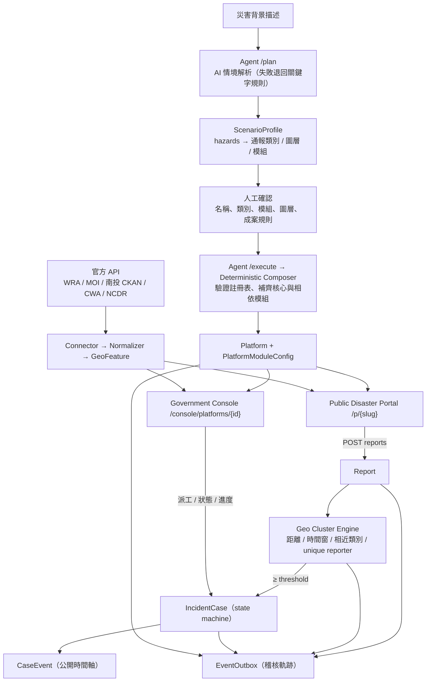

# AidFlow — 系統架構

## 1. 總覽



三個容器（Docker Compose）：`db`（PostgreSQL 16）、`api`（FastAPI，含 media volume）、`web`（Next.js）。

## 2. 後端分層

```text
apps/api/app/
├── domain/      純規則，無 I/O：categories（類別 + 相近群組 + 分級）、hazards、case_states（enum + transitions）
├── modules/     ModuleSpec / registry / aidflow_modules（9 領域）/ scenarios（compose_profile）
├── services/    scenario_rules、ai_agent、agent_orchestrator、platform_service（composer）、
│                report_service、cluster_service、case_service、privacy_service、situation_service、
│                official_data_service、media_service、notification_service、demo_seed_service、outbox_service
├── connectors/  nantou_open_data、moi_shelters、wra、cwa、ncdr、line（+ base：http / ssl / feature helpers）
├── routers/     public（開放）、agent / platforms / cases / modules / demo（API key gate）
├── schemas/     Pydantic 合約
└── db/          SQLAlchemy models；alembic/ migrations
```

- routers 只做 HTTP 與錯誤對應；services 擁有交易邊界；domain 與 connectors 的 normalizer 可離線單元測試。
- LLM 只出現在 `ai_agent.parse_scenario`，且只能從封閉選項挑選；任何例外回傳 `None`。

## 3. 資料模型

| 表 | 用途 |
| --- | --- |
| `platforms` | 一場災害一個平台：slug、county/towns、hazards、scenario 快照、modules、layers、configuration（cluster_policy、map）、status |
| `platform_module_configs` | 每平台的模組啟用與設定（`two_report_trigger` 存成案規則） |
| `reports` | 民眾通報；`reporter_key` 為加鹽雜湊（聯絡方式 → 裝置識別），用於計算不同回報者 |
| `report_clusters` | 同災點通報聚類：centroid、report_count、unique_reporter_count、status（open/promoted/closed/dismissed） |
| `incident_cases` | 正式案件；`status` 為 `CaseStatus` enum；`case_number` 在平台內唯一 |
| `case_assignments` | 派工（單位／帶隊／聯絡方式，內部） |
| `case_events` | 案件歷史；`public=true` 的列構成公開時間軸 |
| `report_photos` | 照片 metadata（bytes 在 MEDIA_ROOT）；kind = before/scene/after，source = citizen/agency |
| `event_outbox` | 交易型 outbox，所有領域事件 |

Migrations：`0010_aidflow_core` 建立上表；`0011_retire_resqlink_tables` 移除 ResQLink 專屬表（downgrade 可重建）；`0012_case_number_per_platform` 調整唯一性範圍。舊 migration 未修改。

## 4. 同地點多人回報成案（deterministic）

```text
report(lat, lon, category, reporter_key, created_at)
  → bbox 預篩 open/promoted clusters（同平台）
  → pick_cluster: 相近類別（SIMILAR_GROUPS）∧ last_reported_at 在 time_window 內 ∧ haversine ≤ radius，取最近
  → 無 → 開新 cluster
  → 重算 centroid / report_count / unique_reporter_count（同 reporter_key 只計一次；匿名依 policy）
  → cluster.case_id 為空 ∧ unique ≥ required → create_case_from_cluster（status awaiting_dispatch）
  → cluster 已成案 → attach_report_to_case（公開時間軸多一筆「第 N 筆民眾回報」）
```

Policy 來源：settings 預設 → 平台 `configuration.cluster_policy`（可在規劃時與後台修改，並 clamp 在安全範圍）。

## 5. 案件狀態機

```text
reported → verifying → threshold_reached → awaiting_dispatch → assigned → en_route → on_site → processing → resolved → closed
                                                      ↘ dismissed        ↺ awaiting_dispatch（取消派工）   ↺ processing（重開）
```

`domain/case_states.py` 是唯一的真相來源：`TRANSITIONS` 決定後台可按的按鈕（`next_statuses`）、`PUBLIC_LABELS`/`PUBLIC_PHASE` 決定公開端用語與顏色。

## 6. 隱私分離

| | 內部 API（API key） | 公開 API `/v1/public` |
| --- | --- | --- |
| 座標 | 精確 | 四捨五入至 3 位小數（≈110 m） |
| 地址 | 原文 | `mask_address`：去門牌／巷弄／樓層，保留路段／村里 |
| 姓名／電話／Email | 可見 | 不輸出；自由文字經 `redact_text` |
| 案件事件 | 含內部備註 | 僅 `public=true` |
| 照片 | 全部 | `public=true` |

## 7. 官方資料層

```text
Government API → connectors/<source>.fetch_*() → map_*()（純函式，離線測試）→ GeoFeature[]
  → official_data_service.get_layer(platform, layer)（TTL 快取、狀態 ok / disabled / unavailable / not_enabled）
  → /v1/public/platforms/{slug}/layers/{layer} → IncidentMap
```

憑證不存在 → `ConnectorDisabled` → 圖層 `disabled`；上游錯誤 → `ConnectorError` → `unavailable`。兩者都不會產生假資料。政府網站憑證缺少 Subject Key Identifier 時，`connectors/base.py` 只關閉 OpenSSL 的 strict profile，鏈與主機名驗證維持開啟。

## 8. 前端

- `app/p/[slug]`：態勢首頁（KPI → 地圖 → 最新災情 → 進度／趨勢／官方資訊）、案件清單、案件詳情（進度條＋時間軸＋照片）、行動優先通報表單（類別來自平台設定）。
- `app/console`：平台列表、規劃器（分析 → 逐項確認 → 建立）、指揮中心（KPI、地圖＋佇列、聚類／通報／圖層／規則／稽核）、案件工作台（派工、狀態機、公開進度、照片、附近案件）、模組註冊表、介接狀態。
- `components/TerrainMap`（公開端首頁）：MapLibre GL，OpenFreeMap 向量底圖（標籤強制 `name:zh`）＋ AWS Terrain Tiles 3D 地形與山影，全部免金鑰。資料以形狀呈現：正式案件＝立柱（高度＝不同回報者人數、顏色＝災情類別、底部圓環＝處理狀態、critical 脈衝）；未成案聚類＝空心環；通報＝小點；熱區蓋在地形上；派工＝從消防分隊（真實座標）或鄉鎮中心（示意）飛向案件的虛線弧；雨量站＝依 24h 雨量的立柱、水位站＝依警戒等級的圓盤、CAP 示警＝面。立柱高度與足跡隨 zoom 縮放；24 小時回放滑桿以 `created_at` 篩選。手機預設 2D。
- `components/portal/Hud`：狀態列、圖層 chips、案件面板（清單 ↔ 選取案件的進度與時間軸）、時間回放器，全部浮在地圖上。
- `components/IncidentMap`（後台、通報表單、案件頁）：Leaflet + markercluster + heat；方塊＝案件，虛線圓＝未成案聚類，小圓點＝通報。圖層開關由平台 `layers` 驅動。

## 9. 出勤派遣與車輛

```text
case.category → responders.CATEGORY_RESPONDERS → unit kinds（消防／工務／水利／水保／警察／公所／台電）
  → responder_units（消防：南投 CKAN 測量座標；機關：設定檔、鄉鎮示意位置）
  → 距離排序 → 前 3 名以 OSRM 取得道路路徑與 ETA（失敗退回直線估算並標示）
  → POST /cases/{id}/dispatch：assign（狀態機）＋ route/eta/vehicles ＋ dispatch_channel（LINE → webhook → 模擬）
  → CaseEvent「已通報 X（管道），預計 N 分鐘抵達」＋ outbox dispatch.created
```

車輛位置（`responder_service.vehicles`）：先取 `vehicle_positions` 內 180 秒內的 AVL ping（`source=avl`）；沒有時用派遣時間、路徑長度與平均車速推算（`source=simulated`，準備 → 前往 → 抵達 → 案件完成後返隊），完全由時間戳推導，不需背景 worker。每個單位依案件類別派出一組車輛（`domain/responders.vehicles_for`，例如受困＝消防車 ×2＋救護車、道路＝工程車 ×2）。示範平台（`configuration.demo`）且案件仍在「已派員／前往中」時，模擬車輛會循環重播整段路程（`VEHICLE_SIM_LOOP_DEMO`，回應標記 `replay`，UI 標示「示範重播」），讓幾小時前 seed 的示範仍看得到車在路上；正式平台永遠不會重播。前端每 3 秒輪詢並在兩次輪詢間內插，移動平滑，行駛中的車拖著漸層尾跡（`line-gradient`，150 秒內的軌跡）；抵達的車停在路徑終點前 35 m，縮小時再依螢幕像素往來向退後，避免被案件圖釘蓋住。


### 3D 視覺層次

3D 模式開啟 MapLibre `sky`（天空 + 距離霧），開場鏡頭推進，「環繞」慢速旋轉（觸碰暫停），待派工／危急案件光環脈動，車輛尾跡。

## 視覺語言（整站）

- **一套地圖引擎**：`lib/mapStyle.ts` 提供 OpenFreeMap liberty 向量底圖（中文標籤）、OSM 點陣備援、AWS 地形；3D 態勢圖（`TerrainMap`）、案件詳情視角、通報選點圖（`PickerMap`）全部共用。Leaflet 僅剩舊的 `IncidentMap`，不再被頁面引用。
- **一套類別圖示**：`lib/categoryIcons.tsx` 的 15 款線條圖示同時用在地圖標竿、通報表單、案件列表、戰情牆與時間軸事件。
- **首頁門面**：精選平台的即時 3D 地圖＋KPI count-up；平台卡片顯示 24 小時通報脈動（由 `/situation` 的 `trend` 繪製）。
- **戰情牆** `/p/{slug}/wall`：全螢幕、鏡頭自動環繞、側欄每 9 秒輪播；資料全部來自既有公開 API，沒有額外端點。
- **指揮中心事件流**：`EventFeed` 讀 `/v1/platforms/{id}/audit`（交易性 outbox），每 8 秒輪詢，新事件滑入；深色戰情配色以 `data-console-theme="dark"` 覆寫設計 token，只作用於 console。
- **成案規則可視化**：通報成功頁的進度環依 `unique_reporters / required_unique_reporters` 逐段填滿；處理前後照片有比對滑桿。
- 測試共用開發資料庫：`conftest.py` 會在測試結束時刪除自己建立的平台，首頁與總覽不再被測試資料淹沒。

## 官方情資第二波（連接器）

`app/connectors/`：`ardswc.py`（警戒 JSON＋三份年度 SHP：下載一次、磁碟快取 7 天、pyshp 解析、TWD97→WGS84、以溪流／潛勢區編號 join 警戒）、`tdx.py`（OIDC client credentials 取權杖，CCTV 依縣市與公路局 bbox 過濾，路況消息以縣市／鄉鎮文字比對）、`moi_population.py`（ODRP013 依縣市分頁抓取，由當月往回找最新一期，彙整到鄉鎮）、`taipower.py`（每日 ZIP 內 CSV，停電範圍文字對應鄉鎮）、`cwa.py` 新增 `fetch_radar_frames`（檔案 API → ProductURL → 下載 PNG 進記憶體，最多 12 幀，由 `/v1/public/radar/{stamp}.png` 代理）、`wra.py` 新增 `fetch_reservoirs`（基本資料 join 最新水情）。

GeoFeature 新增 `Raster` 型別（四角座標＋影像 URL）。前端 `TerrainMap` 以 image source 播放雷達幀（最後一幀停留較久）、以 line 圖層畫潛勢溪流（警戒加發光）、以比例圓＋標籤畫人口與水庫；`IntelPanel`（指揮中心「官方情資」頁籤）整理警戒、水庫、每萬人案件、路況消息與案件附近 CCTV；公開案件頁標示「位於土石流警戒溪流 400 m 內」與最近兩支監視器。

誠實標示：水庫與停電位置為鄉鎮示意（`indicative`）；路況消息無座標只列清單；雷達與 CCTV 未設定金鑰時圖層狀態為 `disabled`。

### 3D 地圖效能守則

開啟地形後 MapLibre 會把非符號圖層烘焙進每塊地磚的貼圖，任何每幀變動的資料或樣式都會讓地磚整疊重畫。`TerrainMap` 因此：資料更新拆成案件／官方圖層／車輛三條獨立路徑；畫布像素比上限 1.25；俯角 46°（上限 60°）；地形與山影共用同一個 DEM source（分開會讓首屏地磚下載加倍）；拖動或縮放期間暫停虛線行進、雷達回放與尾跡更新；尾跡最多每秒更新一次；車燈不閃爍；地面光環為靜態（標竿外圈以 CSS 脈動）；DOM 標竿停用對地形深度緩衝的逐幀讀回（`readPixels`）。

### 任一平台的示範資料

生成精靈的「確認並建立平台」預設勾選「同時帶入示範資料」，生成後會接著呼叫此端點，操作者落地時平台已有完整案件（可取消勾選）。

`demo_seed_service.seed_into_platform(platform, replace)`（`POST /v1/platforms/{id}/demo`，需 DEMO_MODE）把南投豪雨情境的 32 筆通報、成案、派遣與處理流程走一次真實管線灌進指定平台：非南投縣的平台會把座標平移到該縣、鄉鎮與地址改寫成該平台的鄉鎮，平台未啟用的通報類別會退到最接近的可用類別；完成後把 `configuration.demo` 設為 true（車輛以「示範」標示並可重播）。`replace=true` 先刪除該平台既有通報／聚類／案件。建立平台完成頁與指揮中心都有對應按鈕。

### 鄉鎮參考點（全國 368 個）

`app/utils/town_centroids.py` 是**產生出來的**，不要手改。來源是內政部消防署
「避難收容處所點位檔」(data.gov.tw 73242)：每個鄉鎮市區取該轄內所有收容處所座標的
**中位數**。用中位數不用平均數，單一筆打錯的座標就拉不走代表點；用收容處所是因為它
一定位於有人居住的陸地上，比行政區幾何形心更適合拿來定位。

重新產生：

```bash
cd apps/api
python scripts/derive_town_centroids.py out.json
python scripts/render_town_centroids.py out.json app/utils/town_centroids.py
```

這張表撐住三件事：`report_service.nearest_town()`（通報歸屬鄉鎮、統計與篩選）、
`platform_service` 的地圖中心、以及下面示範資料的跨縣平移。在補上這張表之前，
全國只有南投縣有鄉鎮資料，所以**任何非南投的平台，通報的 `town` 都是 null**、
案件標題也就沒有鄉鎮前綴。

### 示範資料怎麼搬到別的縣市

`_site_transform` 不是把整個南投場景**整體平移**到目標縣市——縣市形心對縣市形心的
平移，一碰到花蓮、台東、宜蘭這種南北狹長的縣市，就會把一半的災點丟進太平洋（實際
發生過）。正確的做法是**以鄉鎮為單位**：

1. 每個示範地點屬於某個南投鄉鎮，先把它對應到目標縣市的一個**真實鄉鎮**
   （優先用平台自己宣告的鄉鎮，否則依序分散到該縣市的鄉鎮）。
2. 保留該地點相對於原鄉鎮參考點的位移，套到目標鄉鎮參考點上。因為參考點來自收容
   處所，必然是陸地。
3. 位移上限由**目標縣市自己的幾何**決定（`_offset_cap_m`：該縣市鄉鎮間距中位數的
   一半，夾在 1.5–6 km）。澎湖的鄉鎮相距數公里、花蓮相距數十公里，用同一個固定
   上限不是太擠就是太散。
4. 同一個來源鄉鎮內的所有地點共用**一個縮放係數**（`_township_scales`），不是各自
   裁切。各自裁切會把整個鄉鎮的地點壓到同一個圓上——原本相距 822 m 的兩個災點會
   變成 97 m，聚類就黏在一起了。

地址改寫只會換成**目標縣市確實存在的**鄉鎮；換不到就把來源鄉鎮拿掉，絕不留下
「花蓮縣仁愛鄉」這種不存在的地名。

> 已知殘留：村里名與公路編號（「大同村」「投83線」）仍是南投的。要根治得替每個
> 縣市準備一套在地的情境文案，不是座標問題。

## 資訊架構（使用者動線）

```
/                     系統控制台：輸入災害背景（→ /console/new?brief=…）、已生成平台一覽
  └ /console/new      生成精靈：STEP1 背景 → STEP2 系統規劃 → STEP3 人工確認 → STEP4 生成
        └ 生成完成同時產出兩套系統，完成頁以兩張卡並列：
              民眾通報網站  /p/{slug}            （態勢圖・我要通報・處理進度・戰情牆）
              政府管理後台  /console/platforms/{id}（案件佇列・派遣・官方情資・稽核）
/console              平台管理：全域 KPI、平台清單，每列直接給「政府後台／民眾網站」兩個入口
```

系統控制台採三欄構圖：左為災害背景輸入卡、中為全臺 3D 地形（此層級尚無災害，因此不顯示任何案件）、右為生成流程步驟；頁首透明浮在地圖上。視窗寬度 < 1280px 時流程改折到地圖下方。

命名一致性：全站以「系統控制台 / 民眾通報網站 / 政府管理後台」三個詞描述三個層級，不再混用「首頁・平台總覽・指揮中心・公開網站」。

### 傳輸與繪圖成本（實測後的守則）

以 Playwright 量測後台頁 45 秒的網路用量，原本為 **11.7 MB**，最佳化後為 **0.6 MB**：

| 項目 | 之前 | 之後 | 做法 |
|---|---|---|---|
| 雷達回波影像 | 3600×3600（13.0 MP，GPU 貼圖約 50 MB） | 1264×1400（1.8 MP） | 後端裁切到 `CWA_RADAR_CROP` 視窗並縮到 `CWA_RADAR_MAX_PX`；保留 alpha（量化成調色盤會失去透明背景） |
| 出勤路線 | 782 KB / 8,617 點 | 43 KB / 790 點 | `utils.geo.simplify_line`（RDP，容差 ≈45 m）於輸出時簡化，DB 仍保留完整幾何 |
| 土石流圖層 | 812 KB | 334 KB | 讀 shapefile 時即簡化環線（容差 ≈28 m，單環上限 140 點） |
| 官方情資（約 950 KB） | 每次開後台都抓 | 只在「官方情資」頁籤開啟時抓 | `IntelPanel` 加 `active` 參數 |
| 稽核軌跡 | 側欄與事件流各抓一次 | 只在「稽核軌跡」頁籤開啟時抓 | 移除側欄重複請求 |

其他：所有輪詢在 `document.hidden` 時暫停；側欄輪詢降為 40 秒並與主輪詢錯開；地圖資料以內容簽章（`featureSignature`）比對，內容相同就不重新上傳 GPU 緩衝也不重繪圖釘；`TerrainMap` 以 `memo` 包裝，後台頁每次輪詢重繪不會波及地圖。

後台地圖的天氣控制：指揮中心地圖左上角固定顯示「天氣」一列（雷達回波／雨量／官方警戒／河川水情／水庫水情），不再只藏在收合的「官方資料」清單裡；雷達首次載入需向氣象署取得並裁切影像，期間 chip 顯示轉圈並在下方標示「載入中…」，完成後顯示觀測時間與回放幀數。

地形高程造成的鏡頭偏移：`flyTo({center})` 的 center 是水平座標，開啟 3D 地形後，海拔約 1,000 公尺的案件會被投影到畫面中心上方約 180 px。`TerrainMap` 在 `moveend` 後以 `map.project()` 量測實際落點並 `panBy` 修正（若使用者中途自行拖動則放棄修正），使地面點準確落在畫面中心。

### 兩個介面的預設圖層（角色分工）

`defaultVisibility(layers, surface)` 依介面給不同預設，兩邊仍可自由切換：

- **民眾通報網站**（`public`）：回答「哪裡危險、我要去哪通報」。預設開啟官方警戒、雷達回波、土石流潛勢溪流；**政府出勤（路線與車輛）預設關閉**——救護車位置屬於作業資訊，chip 仍在（保留公開透明的選項），關閉時也不會輪詢車輛 API。避難收容所全縣約 390 處，預設關閉以免蓋滿地圖。
- **政府管理後台**（`console`）：作業圖像。預設開啟出勤路線與車輛、官方警戒與雷達回波；地圖區塊放大為 8/12 欄、高度 `calc(100vh-268px)`。
- **戰情牆**：掛在應變中心，維持完整作業圖像（出勤恆開）。
- **案件詳情頁**：仍顯示該案件的出勤車輛與 ETA，這是「公開處理進度」的一部分，範圍僅限該案。

雷達影像以 WebP 提供（`image/webp`，1264×1400、約 530 KB／幀，PNG 為 1.4 MB），保留 8 幀回放並以 `max-age=86400, immutable` 快取。

### 平台不累積（示範模式）

`DEMO_MODE` 開啟時，生成器產出的平台是消耗品：

- `platform_service.prune_generated(db, keep)` 只保留最新 `DEMO_KEEP_GENERATED`（預設 1）個生成平台；**內建的南投示範平台（帶有 `configuration.demo_key`）永遠保留**。
- 觸發時機：每次 `POST /v1/agent/execute` 生成完成後、以及 API 啟動時（lifespan）。生成回應會回傳 `retired` 清單。
- 手動清空：`POST /v1/platforms/prune?keep=0`，平台管理頁有「清除生成的平台」按鈕。
- `DEMO_MODE=false`（正式部署）時完全不會刪除任何平台。
